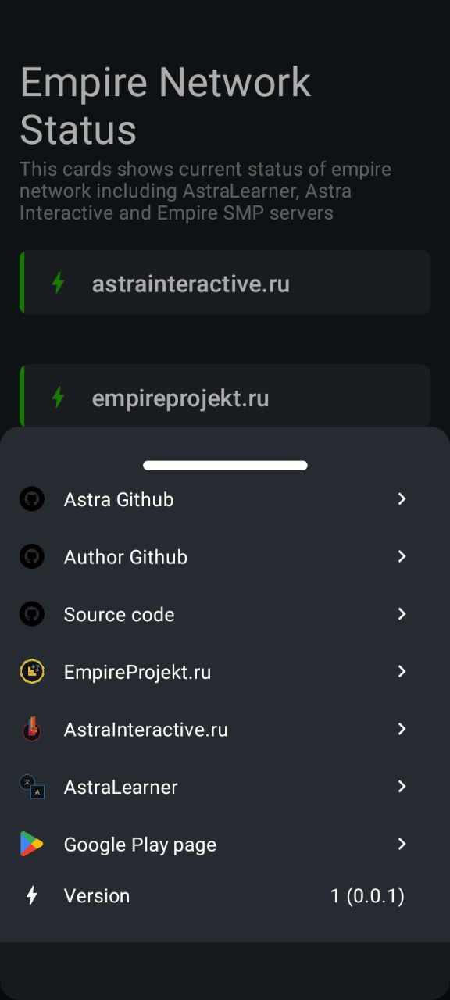
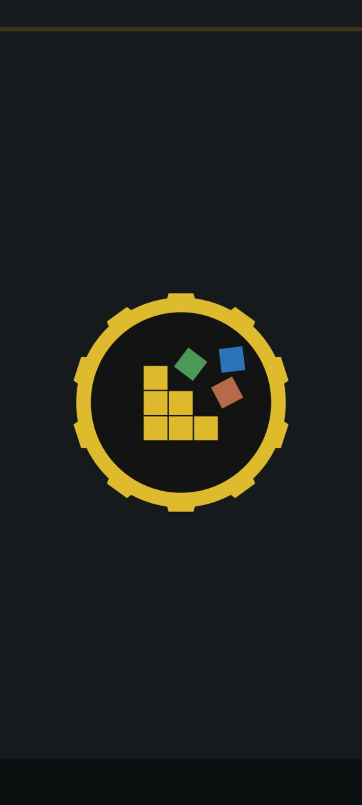
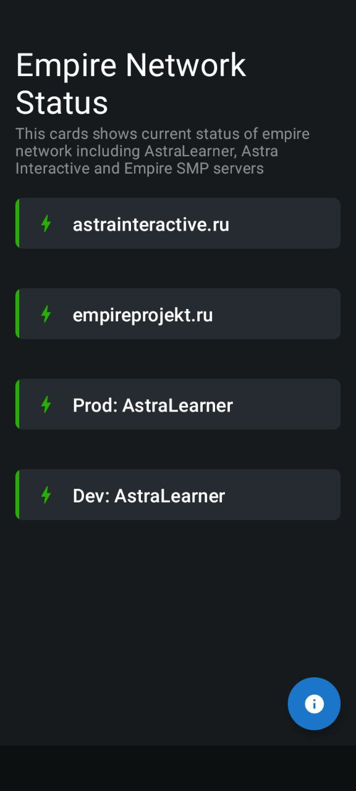

## EmpireProjekt Mobile

Mobile app to monitor Empire Network status

## Content

      
      
      

| Non-default Libraries used |                                  Author/Organization |   
|:---------------------------|-----------------------------------------------------:|
| Moko Libraries             | [IceRock Development](https://github.com/icerockdev) |
| Decompose+Essenty          |       [Arkadii Ivanov](https://github.com/arkivanov) |
| DI, KTX-Core               |    [MobileX](https://github.com/makeevrserg/MobileX) |

## Download either

#### Or find app in the [Github Releases Section](https://github.com/makeevrserg/EmpireProjekt-Mobile/releases/latest)

## Don't forget to checkout [AstraLearner](https://play.google.com/store/apps/details?id=com.makeevrserg.astralearner)!

### And see other tons of projects

- [Organization](https://github.com/Astra-Interactive)
- [My Profile](https://github.com/makeevrserg)