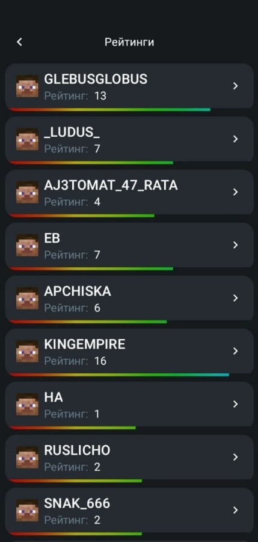
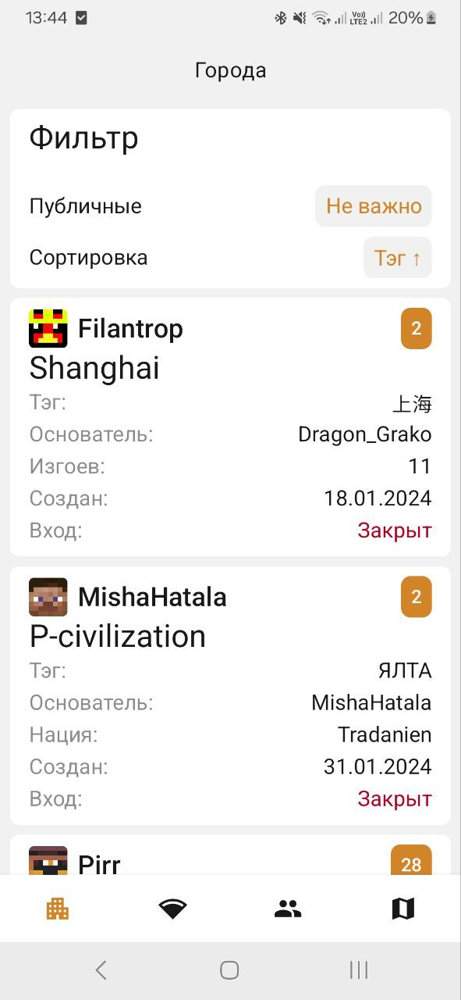
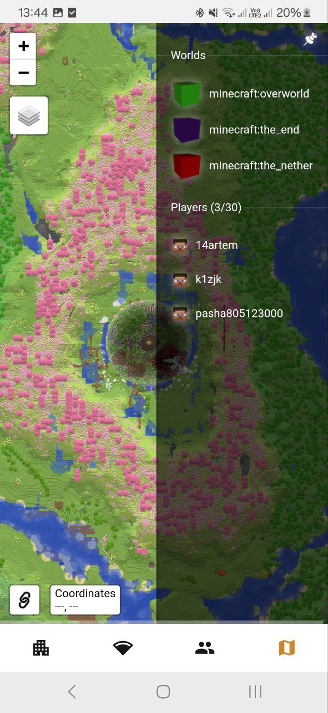

## EmpireProjekt Mobile

This mobile application made specially for [EmpireProjekt](https://empireprojekt.ru)

## Content

You can check statuses of network or see useful links

      
      
      

See the ratings for players

     
      

Watch towns and online-map

     
      

### Don't forget to check out [AstraLearner](https://play.google.com/store/apps/details?id=com.makeevrserg.astralearner)!

## Architecture

The application is build on [The Architecture GuideLines](https://makeevrserg.github.io/ArchitectureTheory/gradle/)

### Some non-standart libraries

| Non-default Libraries used |                                           Author/Organization |   
|:---------------------------|--------------------------------------------------------------:|
| Moko Libraries             |          [IceRock Development](https://github.com/icerockdev) |
| Decompose/MVIKotlin        |                [Arkadii Ivanov](https://github.com/arkivanov) |
| DI                         |               [klibs.kdi](https://github.com/makeevrserg/KDI) |
| Paging                     |   [klibs.paging](https://github.com/makeevrserg/klibs.paging) |
| Micro utils                |     [klibs.mikro](https://github.com/makeevrserg/klibs.mikro) |
| Gradle boilerplate         | [gradle-plugin](https://github.com/makeevrserg/gradle-plugin) |

## Download either

### Or find app in the [GitHub Releases Section](https://github.com/makeevrserg/EmpireProjekt-Mobile/releases/latest)

### Gratitude

- Big thanks to Alex Panov for [slot child example](https://github.dev/AJIEKCX/SpaceXRockets)

### See other tons of my projects

- [Organization](https://github.com/Astra-Interactive)
- [My Profile](https://github.com/makeevrserg)